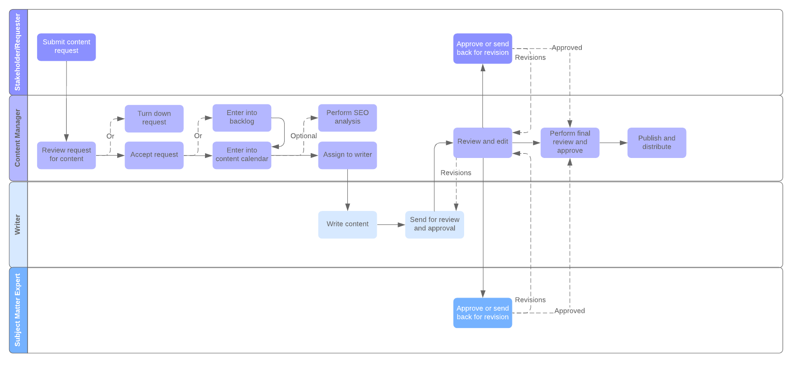

# remoteworklibrary.io


Open Library for Remote Work Culture, Practices and Tools


")

## Content creation process



Content production involves many different people working together and can quickly become tangled and confusing. We organize and streamline our process for everyone involved with the help of this content workflow diagram. Our process shows four roles:

* Stakeholder / Requester: A person or company unit that has an idea for a topic and an interest in publishing it.
* Content Manager: A person from the QAware marketing team. Only members of this role can merge content in this repository to the master branch and publish content.
* Writer: The author of the content.
* Subject Matter Expert: A technical expert who helps the author as a sparring or review partner.

## Write Content

### Precondition

To become an author at the rwl, you need a github account. If you do not have an account yet, you can create one [here](https://github.com/join). If you already have an account, please send an email with your github name to info@remoteworklibrary.io and ask for membership in the `writer` group.

### Start with our project  

[Get used to Hugo](https://gohugo.io/getting-started/quick-start) and then:

1) `hugo new posts/<articleTitle>/index.md` (as file name without blanks, e.g. `hello-world/index.md`)
2) edit content
3) `hugo server -D --minify`

### Edit page meta data

The Hugo Generator creates the content page as a markdown file. After running the generator the meta data must be extended.

Generator example:

```md
---
title: "Hello World"
date: 2020-05-11T10:43:02+02:00
author: ""
type: "post"
image: ""
categories: []
tags: []
draft: true
---

Post text

<!--more-->


  

```

1. Add `lastmod` attribute. Use value of `date` attribute for the first version of your new page.
2. Add `author` attribute. Add a markdown link to your GitHub profile as value.
3. Add `type` attribute with value `post`. Our theme supports more content type. But for the moment we only use `post`.
4. Add `image` attribute. Put an image to the `/static/img` folder and write the link into attribute`s value. More infos about providing image files can be found in the next chapter.
5. Add `categories`: Select one or more fitting categories for your post: `focus`, `collaborate`, `learn`, `socialize & serendipity`, and `rejuvenate`.
6. Add `tags`: Select one or more fitting tags for your post: `tool`, `practice`, `culture`

Final example:

```md
---
title: "Hello World"
date: 2020-05-11T10:43:02+02:00
lastmod: 2020-05-11T10:43:02+02:00
author: "[Josef Fuchshuber](https://github.com/fuchshuber)"
type: "post"
image: "img/hello-world.jpg"
categories: ["practice"]
tags: ["collaborate", "learn", "socialize"]
draft: true
---
```

### Add images

Please search and download your images by [gettyimages](https://www.gettyimages.de/). Store title and content images for your post in the same folder as the post's markdown file and refer them in markdown:

```md

```

or as a figure with caption:

```md

  

```

Title image rules:

* Please provide images (JPG, PNG) in 16:9 aspect ratio.
* Best images size for the current page layout is 730 x 410 px.

For further information and storage of source files we have an own GitHub project [remoteworklibrary-assets](https://github.com/remoteworklibrary/remoteworklibrary-assets).

## Docker Build & Run

### Build image with current content

```bash
docker build -t gcr.io/engineering-cloud/remoteworklibrary:latest .
```

### Run Docker container from image

```bash
docker run -p 1313:80 --rm gcr.io/engineering-cloud/remoteworklibrary:latest
```

Start your browser and open <http://localhost:1313/.>

## Deploy Site

* Site is automatically deployed by a github action to a github page
  * GitHub project: https://github.com/remoteworklibrary/remoteworklibrary.github.io
  * Site: https://www.remoteworklibrary.io
* Test environment with draft posts is automatically deployed by a github action to a Google Cloud Run service
  * Site: https://remoteworklibrary-zkop4aqvwa-ez.a.run.app
